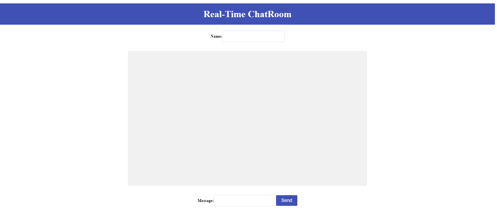
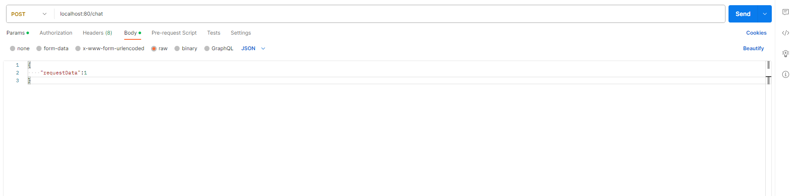

# Real-Time Chatroom

----
### Description:  
A real-time chatroom where users can send messages, and receive messages from other users in real-time. The communication between the client and server is facilitated using SSE and Kafka messaging.

~~**Message Accept Type: Integer Only**  
Users can send integers through text box and receive the result of calculation in real-time.~~

### Technologies Used:
- Java (Spring Boot)
- Spring Kafka
- Server-Sent Events (SSE)
- Redis
- **Frontend:** HTML & JavaScript & Thymeleaf

### Environment Setup (for Windows):
Exit the environment: ***ctrl+c***
1. *Kafka*  
Installation and Quickstart link to [Kafka](https://kafka.apache.org/quickstart)  
Open **TWO** terminals to start the ZooKeeper service & Kafka broker service respectively  
i.   bin\windows\zookeeper-server-start.bat config\zookeeper.properties  
ii.  bin\windows\kafka-server-start.bat config\server.properties   
Topic would be created after starting the ExampleApplication      
****To connect to Kafka from a different machine, replace the [localhost]:9092 with the [IPv4] address of that machine in application.properties***   

2. *Redis*  
Installation and Quickstart link to [Redis](https://redis.io/docs/getting-started/installation/install-redis-on-windows/)  
Open **Ubuntu** and running 'sudo service redis-server start' & 'redis-cli' commands.  
****Need to input password after starting the server***   

*For first installation, need to set up username and password (password unseen)*

### Usage:
Step 1: Start the Kafka and Redis (please refer to [Environment Setup](#environment-setup-for-windows))

Step 2: Start the application   
a. Run the application via ExampleApplication.java in Intellij  
b. Maven: Clean and package --> Run KafkaExampleApplication-0.0.1-SNAPSHOT.jar in Command Prompt

****For remote access, replace the [localhost]:80/chat with the [IPv4] address of machine run the application***   

Step 3: Start chat / Send message  
a. Open a browser and type url: localhost:80/chat.   
- Send message through the below text box and click send or press 'enter' 
    

b. Open **POSTMAN** and use method *POST* (url = localhost:80/chat) 
- Select Body --> raw --> JSON and send message  

- If sent successfully, received ***'true'***  
 

>****For Redis:***
> The RedisController class provides methods to store and retrieve message (offsets) in Redis
> - Checking Stored Message: Use the Redis CLI and run the ~~GET command 'GET kafka:offsets:my-topic:0'~~  **HGETALL kafka:offsets**
> - If the key exists and the offset has been stored, Redis will return the offset value. If the key does not exist or the offset is not stored, Redis will return a nil response.
